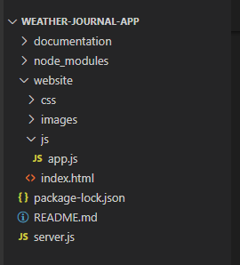
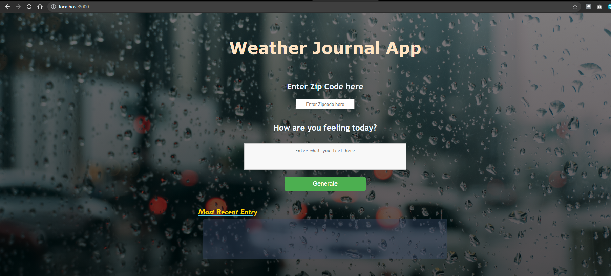
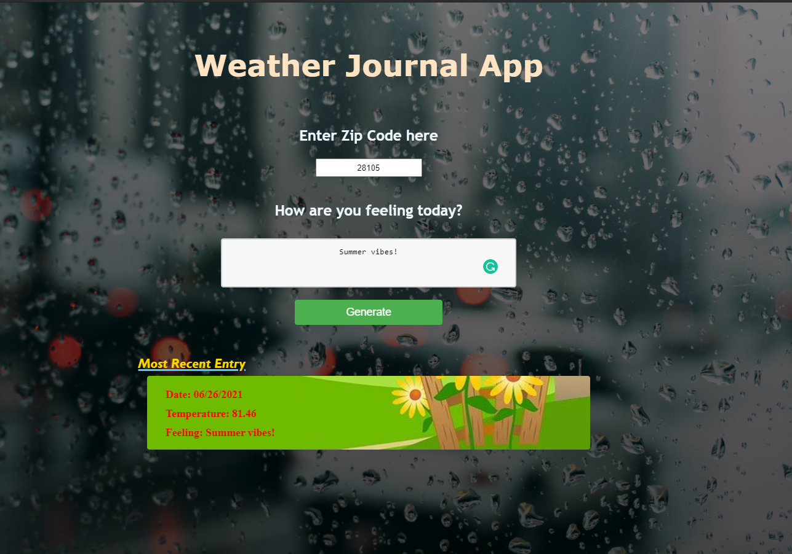
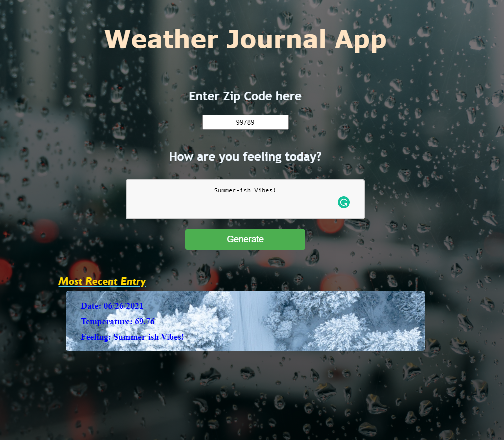

# Weather-Journal App Project

## Overview

This one-page asynchronous web app uses Web API from OpenWeatherMap website and user data to dynamically update the UI.

Given the user's zip code and feeling, the UI will update to show the zip code, temperature, and feeling listed in a window that updates the background picture based on the temperature being hot or cold.

## List of software, firmware, and hardware required

You will need to have the following installed softwares and firmwares:

- Node.js
- Express
- body-parser
- cors
- A web browser of your choice

## Project Structure

The following is the project structure and list of files.



## Instructions

### Setting up the environment

- First, make sure you have your node.js installed.
- In the comman window, you will need to run the following lines:

```
npm install express
```

```
npm install body-parser
```

```
npm install cors
```

### Running the local server

- Make sure to navigate to the main directory of the project weather-journal-app

- In the command window, you will run the local server by using the following command

```
node .\server.js
```

- You should see a message that confirms the server is running properly with the port number. For example, if you do not change the port number from 8000, you should see the following message:

```
server running
running on localhost: 8000
```

### Running the application

In your browser, type the address:

```
localhost:{portnumber}
```

In our example, this would be

```
localhost:8000
```

This should open the application page as shown below:



Now you are ready to use the application.

### Examples

- You can enter a zip code of a state that is known to be hot during the summer. In the following example, I used Charlotte, NC 28105.



- Alaska generally have a nice weather during the summer, but sometimes it can get cold. It is not as cold in June, so I had to change the threshold of the hot/cold temperature in my application. The following would be the result if you are in a cold zip code.



## Known bugs

The application's CSS is not designed to be responsive. For the best view experience, use a full sized window on a computer.
